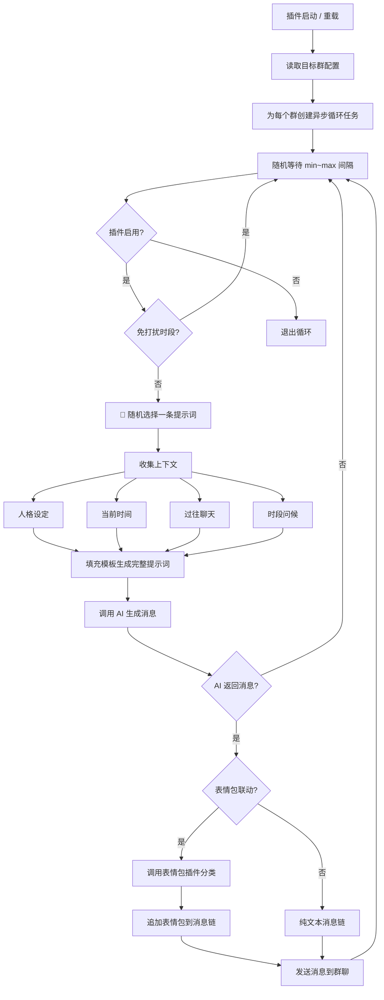

# 💬 主动聊天插件

AstrBot 插件 —— 让机器人根据提示词定时主动向群聊发起话题。

机器人不再是"被动回复"的应答机器——它会在设定的时间间隔内，根据你的设定主动找群友聊天。无论是早安晚安问候、回忆过往聊天内容、还是基于人格设定展开话题，全都支持。

## ✨ 功能特性

- 🕐 **定时主动聊天**：机器人按设定的时间间隔（最小~最大之间随机）主动向群聊发送消息
- 🎲 **随机提示词**：支持多条自定义提示词，机器人每次发送时 **随机选择一条**，让话题更多样
- 🖥️ **可视化提示词管理**：内置 Plugin Page，支持 **增删改查** 提示词，拖拽排序
- 📝 **默认提示词开箱即用**：内置 6 条精心设计的默认提示词（早安、晚安、回忆、人格、日常、热点）
- 🌅 **时段问候**：早上自动问早安，晚上自动说晚安（可配合提示词使用）
- 🧠 **回忆过往聊天**：机器人会回忆与用户最近的聊天内容，自然引出话题
- 🎭 **人格设定联动**：基于用户在 AstrBot 中为机器人设定的人格（Persona）展开话题
- 🔇 **免打扰时段**：设定夜间等免打扰时段，机器人不会在这期间发送消息
- 🎨 **表情包联动**：无缝适配「AI 智能表情包」插件（astrbot_plugin_ai_sticker），主动消息也能搭配表情包
- ⚙️ **WebUI 可视化配置**：所有参数均可在 AstrBot WebUI 管理面板中配置
- 🎮 **管理指令**：提供 `/proactive_chat` 指令组，方便管理员手动控制

## 📁 目录结构

```
astrbot_plugin_proactive_chat/
├── main.py                    # 插件主程序
├── metadata.yaml              # 插件元数据
├── _conf_schema.json          # 配置 Schema（WebUI 可视化配置）
├── requirements.txt           # 依赖声明
├── README.md                  # 本文件
└── pages/                     # Plugin Page（可视化提示词管理）
    └── console/
        ├── index.html         # 管理面板页面
        ├── app.js             # 页面交互逻辑
        └── style.css          # 页面样式
```

## 🚀 快速开始

### 1. 安装插件

将插件目录放置到 AstrBot 的 `data/plugins/` 目录下：

```bash
cd AstrBot/data/plugins
git clone https://github.com/your/astrbot_plugin_proactive_chat
```

或在 AstrBot WebUI 插件市场中搜索安装。

### 2. 启用插件

在 AstrBot WebUI 的「插件管理」中找到「主动聊天」，点击启用。

### 3. 配置目标群聊

在插件配置中，填入需要机器人主动聊天的群号（**target_groups**），每行一个：

```
123456789
987654321
```

### 4. 管理提示词（推荐）

在 AstrBot WebUI 中进入「主动聊天」插件的**管理面板**（Plugin Page），你可以：

- ➕ **添加新提示词**：填写名称和内容即可添加
- ✏️ **编辑提示词**：直接在面板中修改名称和内容
- 🗑️ **删除提示词**：一键删除不需要的提示词
- ⬆️⬇️ **排序提示词**：上下移动调整顺序
- 💾 **批量保存**：编辑完成后点击保存

机器人每次主动聊天时会从所有提示词中 **随机选择一条**，建议保留 5-10 条不同方向的提示词以获得最佳效果。

### 5. 调整设置（可选）

- **min_interval_seconds / max_interval_seconds**：设置消息发送间隔范围
- **custom_prompts**：通过 WebUI 配置直接编辑 JSON 格式的提示词列表
- **silent_hours_start / silent_hours_end**：设置免打扰时段

配置完成后，点击「重载插件」或发送 `/proactive_chat reload` 指令即可生效。

## ⚙️ 配置项说明

| 配置项 | 类型 | 默认值 | 说明 |
|--------|------|--------|------|
| `enable` | bool | true | 是否启用插件 |
| `min_interval_seconds` | int | 1800 (30分钟) | 最小发送间隔（秒） |
| `max_interval_seconds` | int | 7200 (2小时) | 最大发送间隔（秒） |
| `target_groups` | list | [] | 目标群号列表，每行一个 |
| `prompt_template` | text | 见下方 | 兜底提示词模板（custom_prompts 为空时使用） |
| `custom_prompts` | text(JSON) | 6条默认提示词 | 自定义提示词列表，JSON 数组格式。推荐在 Plugin Page 中可视化编辑 |
| `enable_time_greeting` | bool | true | 启用早晚问候 |
| `morning_greeting_prompt` | text | — | 早安问候额外提示 |
| `night_greeting_prompt` | text | — | 晚安问候额外提示 |
| `enable_past_conversation` | bool | true | 启用回忆过往聊天 |
| `past_conversation_count` | int | 3 | 回忆的聊天轮数 |
| `enable_persona_chat` | bool | true | 启用基于人格设定聊天 |
| `enable_sticker_integration` | bool | true | 启用表情包联动 |
| `sticker_probability` | int | 40 | 表情包触发概率 (0-100) |
| `silent_hours_start` | int | 0 | 免打扰开始小时 (0-23) |
| `silent_hours_end` | int | 0 | 免打扰结束小时 (0-23) |

### 默认提示词列表

插件内置 6 条默认提示词，开箱即用：

| # | 名称 | 用途 |
|---|------|------|
| 1 | 早安问候 | 早上以轻松语气问早安，开启新一天 |
| 2 | 晚安问候 | 晚上温暖道晚安，提醒休息 |
| 3 | 回忆聊天 | 回顾最近聊天记录，延续未聊完的话题 |
| 4 | 人格话题 | 根据人格设定中的特征/爱好引出话题 |
| 5 | 日常分享 | 像朋友一样分享日常趣事或感悟 |
| 6 | 热点话题 | 基于当前日期聊节日/季节等热门话题 |

**随机选择机制**：机器人每次主动聊天时，从所有提示词中 **等概率随机选取一条** 作为本次聊天的方向。

### 提示词变量说明

每条提示词中可使用以下变量，插件会自动替换：

| 变量 | 说明 | 示例 |
|------|------|------|
| `{persona}` | 机器人的当前人格设定 | 「你是一个活泼可爱的猫娘…」 |
| `{current_time}` | 当前日期和时间 | 「2026年06月29日 14:30，星期一」 |
| `{extra_context}` | 额外上下文信息 | 时段问候提示 + 过往聊天回忆 + 人格参考 |

### 兜底提示词模板

当自定义提示词列表为空时（如用户清空了所有提示词），插件会使用下方的 `prompt_template` 作为兜底。

```
你是一个聊天机器人，现在你需要主动发起聊天。

你的身份设定：
{persona}

当前时间：{current_time}

{extra_context}

请根据以上信息，自然地向群聊发送一条消息，主动开启话题。消息要求：
1. 语气自然、口语化，像真人朋友聊天
2. 消息简短（控制在100字以内）
3. 符合你的身份设定
4. 不要提及"主动聊天"、"提示词"等元信息

请直接输出你要发送的消息内容，不要带任何前缀、引号或解释。
```

## 🎯 工作原理



## 🎮 管理指令

| 指令 | 权限 | 说明 |
|------|------|------|
| `/proactive_chat status` | 所有人 | 查看插件运行状态和目标群 |
| `/proactive_chat trigger` | 管理员 | 立即在当前群触发一次主动聊天 |
| `/proactive_chat reload` | 管理员 | 重新加载配置并重启所有任务 |
| `/proactive_chat start` | 管理员 | 启动所有主动聊天任务 |
| `/proactive_chat stop` | 管理员 | 停止所有主动聊天任务 |

## 🎨 表情包联动

本插件无缝适配「**AI 智能表情包**」插件（`astrbot_plugin_ai_sticker`）。

**联动效果**：当机器人主动发送聊天消息时，会自动调用表情包插件分析消息语气，从对应分类中随机选择一张表情包图片，追加到消息末尾一起发送。

**使用要求**：
1. 确保已安装并启用 `astrbot_plugin_ai_sticker` 插件
2. 在表情包插件中配置好分类和图片
3. 在本插件配置中开启 `enable_sticker_integration`
4. 调整 `sticker_probability` 控制表情包出现频率

**无需额外配置**：插件会自动检测表情包插件是否已加载，若未安装则自动降级为纯文本模式，不影响正常使用。

## 📋 依赖

本插件仅使用 AstrBot 内置 API 和 Python 标准库（`asyncio`、`random`、`datetime`、`json`），无需额外安装第三方依赖。

## 🔧 兼容性

- **AstrBot 版本**：≥ v4.16
- **平台**：Windows / Linux / Docker
- **消息平台**：主要支持 QQ（aiocqhttp / OneBot v11）。其他平台可通过配置完整 `unified_msg_origin` 来支持。

### 多平台配置

默认情况下，插件将纯数字群号解析为 `aiocqhttp:group:{group_id}`。

如果你使用其他平台（如 Telegram、Discord 等），请在 `target_groups` 中填写完整的 `unified_msg_origin` 格式：

```
aiocqhttp:group:123456789
telegram:group:-1001234567890
discord:guild:123456789:channel:987654321
```

## 📄 许可证

MIT License

## 🙏 致谢

- [AstrBot](https://github.com/AstrBotDevs/AstrBot) — 强大的聊天机器人框架
- [AI 智能表情包插件](https://github.com/user/astrbot_plugin_ai_sticker) — 联动表情包功能
